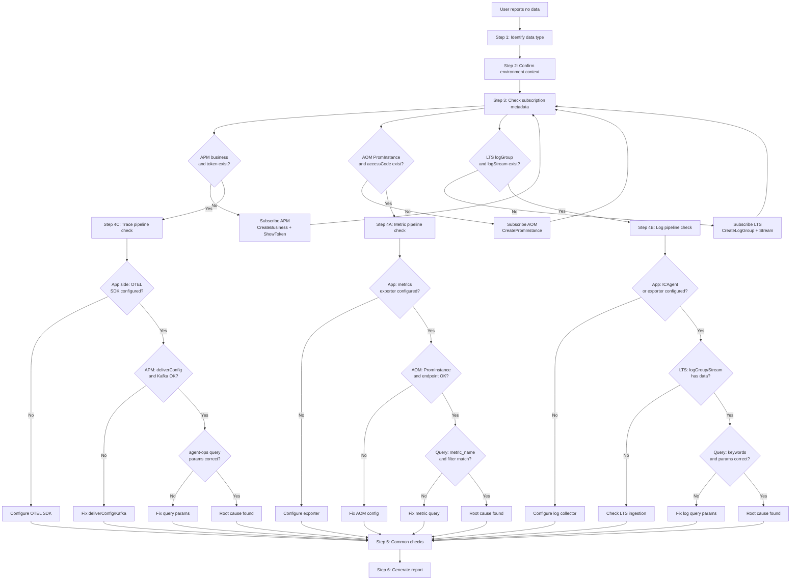
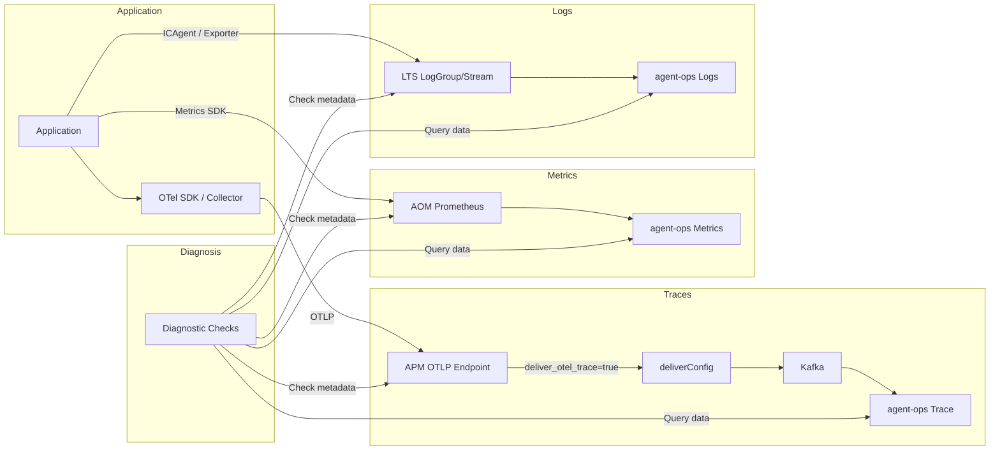

# Data Flow Diagram

## Diagnostic Flow

```mermaid
flowchart TD
    START[User reports no data] --> STEP1[Step 1: Identify data type]
    STEP1 --> STEP2[Step 2: Confirm environment context]
    STEP2 --> STEP3[Step 3: Check subscription metadata]

    STEP3 --> META_APM{APM business<br/>and token exist?}
    STEP3 --> META_AOM{AOM PromInstance<br/>and accessCode exist?}
    STEP3 --> META_LTS{LTS logGroup<br/>and logStream exist?}

    META_APM -->|No| FIX_APM[Subscribe APM<br/>CreateBusiness + ShowToken]
    META_APM -->|Yes| DIAG_TRACE[Step 4C: Trace pipeline check]
    META_AOM -->|No| FIX_AOM[Subscribe AOM<br/>CreatePromInstance]
    META_AOM -->|Yes| DIAG_METRIC[Step 4A: Metric pipeline check]
    META_LTS -->|No| FIX_LTS[Subscribe LTS<br/>CreateLogGroup + Stream]
    META_LTS -->|Yes| DIAG_LOG[Step 4B: Log pipeline check]

    FIX_APM --> STEP3
    FIX_AOM --> STEP3
    FIX_LTS --> STEP3

    DIAG_TRACE --> TRACE_APP{App side: OTEL<br/>SDK configured?}
    TRACE_APP -->|No| FIX_APP[Configure OTEL SDK]
    TRACE_APP -->|Yes| TRACE_APM{APM: deliverConfig<br/>and Kafka OK?}
    TRACE_APM -->|No| FIX_DC[Fix deliverConfig/Kafka]
    TRACE_APM -->|Yes| TRACE_QUERY{agent-ops query<br/>params correct?}
    TRACE_QUERY -->|No| FIX_QP[Fix query params]
    TRACE_QUERY -->|Yes| DONE1[Root cause found]

    DIAG_METRIC --> METRIC_APP{App: metrics<br/>exporter configured?}
    METRIC_APP -->|No| FIX_METRIC_APP[Configure exporter]
    METRIC_APP -->|Yes| METRIC_AOM{AOM: PromInstance<br/>and endpoint OK?}
    METRIC_AOM -->|No| FIX_METRIC_AOM[Fix AOM config]
    METRIC_AOM -->|Yes| METRIC_QUERY{Query: metric_name<br/>and filter match?}
    METRIC_QUERY -->|No| FIX_METRIC_QP[Fix metric query]
    METRIC_QUERY -->|Yes| DONE2[Root cause found]

    DIAG_LOG --> LOG_APP{App: ICAgent<br/>or exporter configured?}
    LOG_APP -->|No| FIX_LOG_APP[Configure log collector]
    LOG_APP -->|Yes| LOG_LTS{LTS: logGroup/Stream<br/>has data?}
    LOG_LTS -->|No| FIX_LOG_LTS[Check LTS ingestion]
    LOG_LTS -->|Yes| LOG_QUERY{Query: keywords<br/>and params correct?}
    LOG_QUERY -->|No| FIX_LOG_QP[Fix log query params]
    LOG_QUERY -->|Yes| DONE3[Root cause found]

    DONE1 --> STEP5[Step 5: Common checks]
    DONE2 --> STEP5
    DONE3 --> STEP5
    FIX_APP --> STEP5
    FIX_DC --> STEP5
    FIX_QP --> STEP5
    FIX_METRIC_APP --> STEP5
    FIX_METRIC_AOM --> STEP5
    FIX_METRIC_QP --> STEP5
    FIX_LOG_APP --> STEP5
    FIX_LOG_LTS --> STEP5
    FIX_LOG_QP --> STEP5

    STEP5 --> STEP6[Step 6: Generate report]
```

## Data Pipeline Overview

```mermaid
flowchart LR
    subgraph Application
        APP[Application]
        OTEL[OTel SDK / Collector]
        APP --> OTEL
    end

    subgraph Traces
        APM[APM OTLP Endpoint]
        DC[deliverConfig]
        KAFKA[Kafka]
        AO_TRACE[agent-ops Trace]
        OTEL -->|OTLP| APM
        APM -->|deliver_otel_trace=true| DC
        DC --> KAFKA
        KAFKA --> AO_TRACE
    end

    subgraph Metrics
        AOM[AOM Prometheus]
        AO_METRIC[agent-ops Metrics]
        APP -->|Metrics SDK| AOM
        AOM --> AO_METRIC
    end

    subgraph Logs
        LTS[LTS LogGroup/Stream]
        AO_LOG[agent-ops Logs]
        APP -->|ICAgent / Exporter| LTS
        LTS --> AO_LOG
    end

    subgraph Diagnosis
        DIAG[Diagnostic Checks]
        DIAG -->|Check metadata| APM
        DIAG -->|Check metadata| AOM
        DIAG -->|Check metadata| LTS
        DIAG -->|Query data| AO_TRACE
        DIAG -->|Query data| AO_METRIC
        DIAG -->|Query data| AO_LOG
    end
```
