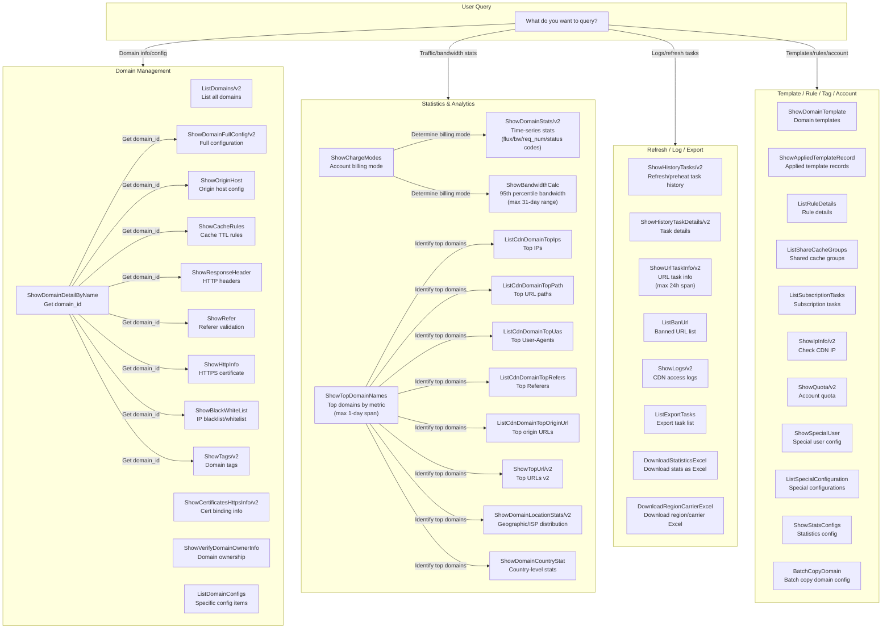

# Data Flow Diagram — CDN Query Reference



## Data Flow Summary

| Category | APIs | Key Workflows |
|----------|------|---------------|
| Domain Management | 14 | List domains → Get domain_id → Query specific configs |
| Statistics & Analytics | 12 | Query billing mode → Query stats → Drill down by dimension |
| Refresh / Log / Export | 8 | Query task history → Get task details → Download logs/reports |
| Template / Rule / Tag / Account | 11 | Query templates/rules → Check account quota/IPs |

## Common Prerequisite Pattern

```
Step 1: ShowDomainDetailByName --domain_name=<domain>  →  obtain domain_id
Step 2: Use domain_id for APIs that require it:
        - ShowHttpInfo
        - ShowOriginHost
        - ShowBlackWhiteList
        - ShowCacheRules
        - ShowResponseHeader
        - ShowRefer
        - ShowTags/v2
```
