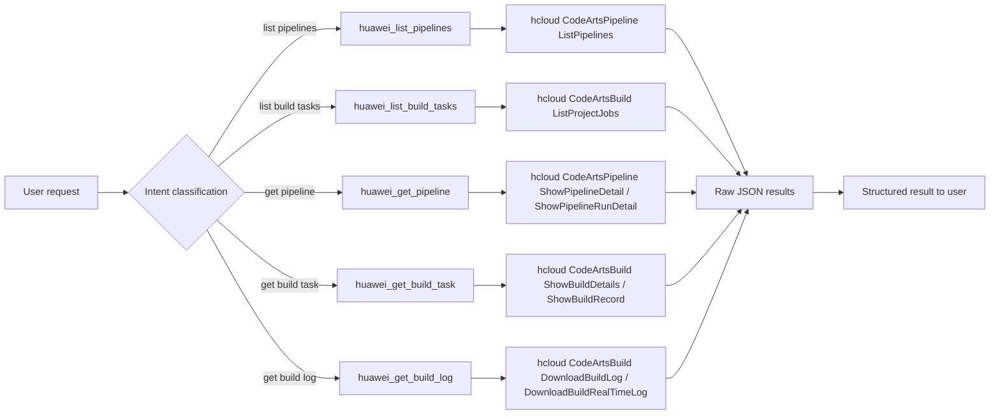
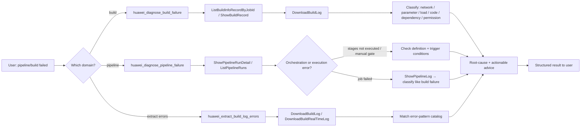
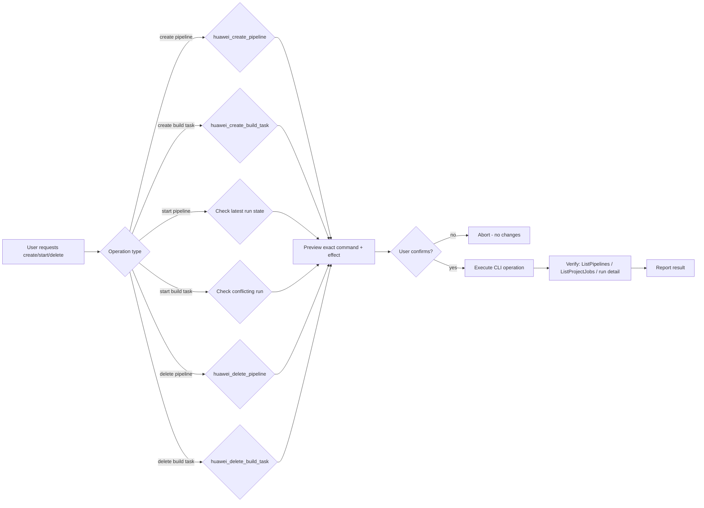
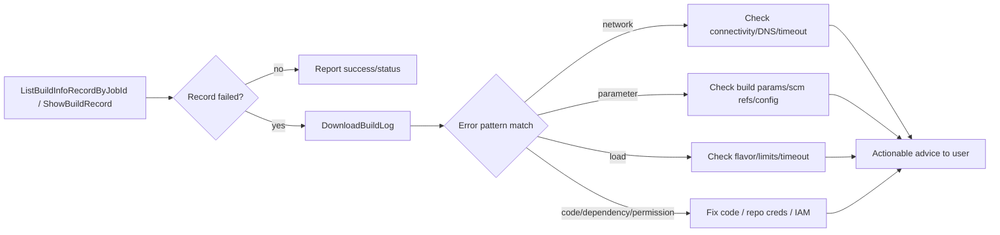

# Data Flow Diagram — huawei-cloud-codearts-pipeline-diagnose

## 1. Query Flow (R3 — automatic execution)

## 2. Analyze Flow (R3 — automatic execution)

## 3. Manage Flow (R2/R1 — preview + confirm)

## 4. Failure Root-Cause Analysis (build)

