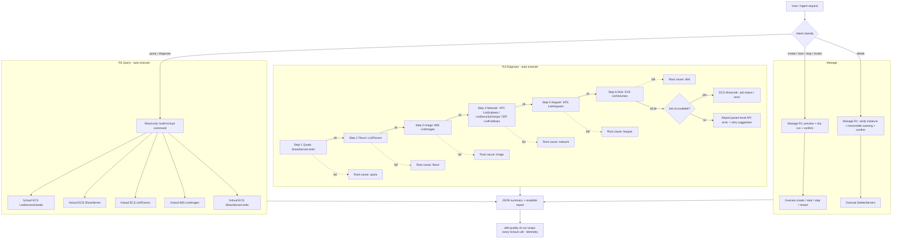

# Data Flow Diagram

Diagnosis flow rule: execute steps **in order** (quota → flavor → image → network → keypair →
disk); stop at the first failing check and report that root cause with evidence and a fix
suggestion. If every check passes but the create request still failed, report the exact API
error body from the request parameters (or the `ShowJob` result when a job id exists) and
suggest a retry.