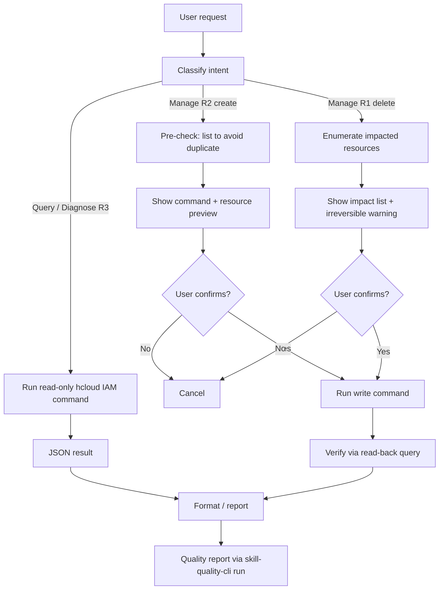
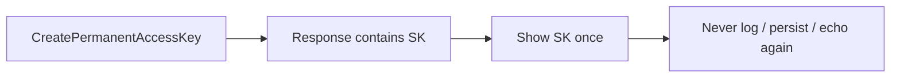
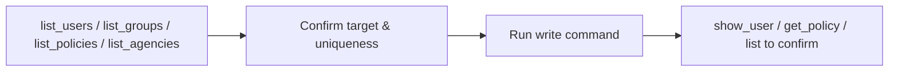

# Data Flow Diagram

## Overall flow

```mermaid
flowchart TD
    A[User request] --> B[Classify intent]
    B -->|Query / Diagnose R3| C[Run read-only hcloud IAM command]
    C --> C2[JSON result]
    C2 --> D[Format / report]
    D --> E[Quality report via skill-quality-cli run]

    B -->|Manage R2 create| F[Pre-check: list to avoid duplicate]
    F --> G[Show command + resource preview]
    G --> G1{User confirms?}
    G1 -- No --> H[Cancel]
    G1 -- Yes --> I[Run write command]
    I --> J[Verify via read-back query]
    J --> D

    B -->|Manage R1 delete| K[Enumerate impacted resources]
    K --> L[Show impact list + irreversible warning]
    L --> L1{User confirms?}
    L1 -- No --> H
    L1 -- Yes --> I
```

## SK handling for create AK/SK

```mermaid
flowchart LR
    A[CreatePermanentAccessKey] --> B[Response contains SK]
    B --> C[Show SK once]
    C --> D[Never log / persist / echo again]
```

## Pre-check → verify pattern for all write actions

```mermaid
flowchart LR
    A[list_users / list_groups / list_policies / list_agencies] --> B[Confirm target & uniqueness]
    B --> C[Run write command]
    C --> D[show_user / get_policy / list to confirm]
```