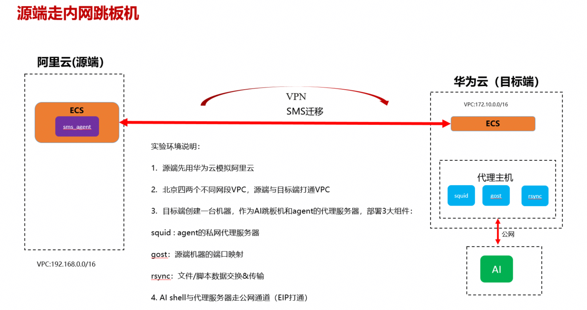

# 私网环境 VMware → 华为云 ECS 迁移 Skill — 使用说明

## 概述

本 Skill 用于在私网环境下将 VMware 虚拟机批量迁移到华为云 ECS。适用于源端和目的端位于不同网络段、通过 VPN 打通的场景。通过代理 ECS 部署 squid + GOST + rsync 实现代理/转发/文件同步，无需公网 IP/EIP。

> **⚠️ 支持范围限制：本 Skill 仅支持私网环境下 Linux x86_64 架构主机的迁移。不支持 ARM（aarch64/arm64）架构、不支持 Windows 操作系统、不支持公网直连模式。详见 [支持范围与限制](#支持范围与限制)。**

### 迁移网络架构



## 目录

- [支持范围与限制](#支持范围与限制)
- [用户交互前置项（华为云 AI Shell 环境）](#用户交互前置项华为云-ai-shell-环境)
- [环境依赖](#环境依赖)
- [前置手动操作项](#前置手动操作项)
- [Excel 模板说明](#excel-模板说明)
- [AK/SK 凭证配置](#aksk-凭证配置)
- [快速开始](#快速开始)
- [命令参数详解](#命令参数详解)
- [后台运行模式](#后台运行模式)
- [Skill 文件结构](#skill-文件结构)
- [权限与安全策略](#权限与安全策略)
- [安全组规则](#安全组规则)
- [日志查看](#日志查看)
- [故障排查](#故障排查)
- [所属权管理与防重复创建](#所属权管理与防重复创建)
- [迁移流程详解](#迁移流程详解)

---

## 支持范围与限制

> **本 Skill 仅支持以下迁移场景，超出范围不支持：**

| 维度 | 支持范围 | 说明 |
|------|----------|------|
| 网络环境 | **仅私网（Private Network）** | 源端与目的端位于不同网络段，通过 VPN 打通；不支持公网直连模式 |
| 操作系统 | **仅 Linux** | 不支持 Windows 主机迁移 |
| CPU 架构 | **仅 x86_64（amd64）** | 不支持 ARM（aarch64/arm64）架构迁移 |
| 源端平台 | VMware 虚拟机 | 通过 SMS Agent 实现块级数据同步 |
| 目标平台 | 华为云 ECS | 自动创建目标 ECS 并执行迁移 |

**不支持 ARM 架构的技术原因**：
- **ECS 规格选择**：代码主动排除所有 ARM 规格（kc/ac/ai/kai/kx/ki/ah/as/at/sn 前缀），仅匹配 x86 规格
- **目标镜像**：镜像映射表仅包含 x86_64 公共镜像 ID，无 ARM 镜像
- **rsync 二进制**：预编译包仅提供 x86_64 版本（源码编译兜底可适配 ARM，但未正式验证）

---

## 用户交互前置项（华为云 AI Shell 环境）

> 以下步骤引导用户在华为云 AI Shell（智能体所在的物理主机环境）上完成迁移前的全部准备工作。按顺序执行即可。

### 第 1 步：配置敏感词过滤

在智能体所在的物理主机环境上，将迁移相关的环境变量名称加入敏感词配置，防止凭证泄露到日志或对话中。

**配置文件路径**（任选其一）：
- `~/.huawei/hwcloud/settings.json`
- `/root/.hwcloud/settings.json`

**配置内容示例**：
```json
{
  "sensitive_env": [
    "OPENAI_API_KEY",
    "HW_ACCESS_KEY",
    "HW_SECRET_KEY",
    "HW_SECURITY_TOKEN",
    "migration_Access_Key",
    "migration_Secret_Access_Key",
    "migration_password",
    "migration_proxy_password",
    "migration_proxy_eip"
  ]
}
```

> 配置后，智能体在日志、对话、文件输出中会自动对这些环境变量的值进行脱敏处理。

### 第 2 步：配置环境变量

在智能体所在的物理主机环境上，导入迁移所需的凭证和密码环境变量：

```bash
export migration_Access_Key="你的永久AK"          # HPUA 前缀永久凭证
export migration_Secret_Access_Key="你的永久SK"
export migration_password="${源主机SSH密码}"          # Excel 中 ${migration_password} 占位符引用
export migration_proxy_password="${代理ECS的SSH密码}"  # 代理主机密码
export migration_proxy_eip="代理ECS的公网IP"        # 代理主机公网 IP
export HW_ACCESS_KEY="你的永久AK"                  # 华为云永久 AK（供 hcloud/obsutil 凭证配置使用）
export HW_SECRET_KEY="你的永久SK"                  # 华为云永久 SK（供 hcloud/obsutil 凭证配置使用）
```

> ⚠️ **安全提示**：请勿将上述命令直接粘贴到对话中。建议在终端中直接执行，或写入 `~/.bashrc` 后 `source ~/.bashrc`。

### 第 3 步：配置 hcloud CLI 与 obsutil 凭证

在智能体所在的物理主机环境上，完成华为云 CLI 和 OBS 工具的凭证配置。

**a. hcloud 配置永久 AK/SK**：

```bash
hcloud configure init
```

> 参考文档：https://support.huaweicloud.com/usermanual-hcli/hcli_03_002.html

**b. obsutil AK/SK 凭证配置**（需独立安装 obsutil）：

请在终端中运行以下命令进行配置（AK/SK 可从华为云控制台"我的凭证"页面获取）：

```bash
obsutil config -i=<YourAK> -k=<YourSK> -e=obs.<Region>.myhuaweicloud.com
```

**示例**（cn-north-4 region）：
```bash
obsutil config -i=<YourAK> -k=<YourSK> -e=obs.cn-north-4.myhuaweicloud.com
```

**常见端点**：

| 区域 | 端点 |
|------|------|
| cn-north-1 | obs.cn-north-1.myhuaweicloud.com |
| cn-north-4 | obs.cn-north-4.myhuaweicloud.com |
| cn-east-3 | obs.cn-east-3.myhuaweicloud.com |
| cn-south-1 | obs.cn-south-1.myhuaweicloud.com |
| cn-southwest-2 | obs.cn-southwest-2.myhuaweicloud.com |

### 第 4 步：准备 Excel 任务文件

使用 `/templates/` 目录下的 Excel 模板填入主机信息和代理主机信息：

1. 下载模板生成脚本并生成空白模板：
   ```bash
   python3 templates/generate_template.py
   ```
2. 编辑生成的 Excel 文件，填写两个 Sheet：
   - **Sheet1「主机信息」**：每行一台待迁移的源端主机（主机名、内网IP、端口、用户名、密码、region 等）
   - **Sheet2「代理主机信息」**：代理/跳板机 ECS 的公网IP、私网IP、端口、用户名、密码
3. 密码列推荐使用环境变量占位符（如 `${migration_password}`），避免明文写入

> 详细的字段说明请参考下方 [Excel 模板说明](#excel-模板说明) 章节。

### 第 5 步：上传软件包与 Excel 到 OBS

将迁移所需的软件包和 Excel 文件上传到 OBS 桶，智能体可从 OBS 下载并使用：

**需上传的文件**：
| 文件 | 说明 |
|------|------|
| `私网迁移源主机Linux相关信息1.0.xlsx` | 填写好的 Excel 任务文件 |
| `gost_3.2.6_linux_amd64.tar.gz` | GOST 转发工具包 |
| `rsync-3.5.0-x86_64.tar.gz` | rsync 二进制包 |
| `SMS-Agent.tar.gz` | SMS Agent 安装包 |

**上传命令示例**：
```bash
hcloud obs cp 私网迁移源主机Linux相关信息1.0.xlsx obs://<你的桶名>/Host-Migration/private_network/
hcloud obs cp gost_3.2.6_linux_amd64.tar.gz    obs://<你的桶名>/Host-Migration/private_network/
hcloud obs cp rsync-3.5.0-x86_64.tar.gz        obs://<你的桶名>/Host-Migration/private_network/
hcloud obs cp SMS-Agent.tar.gz                  obs://<你的桶名>/Host-Migration/private_network/
```

### 第 6 步：安装 Skill

在智能体环境中安装 `huawei-cloud-migration-vmware-ecs-private` Skill：

**方式一：使用 npx 安装 Skills**

```bash
# 安装单个 Skill
npx skills add huaweicloud/huaweicloud-skills --skill huawei-cloud-migration-vmware-ecs-private

# 安装全部 Skills
npx skills add huaweicloud/huaweicloud-skills
```

**方式二：手动安装**

```bash
# 克隆仓库
git clone https://github.com/huaweicloud/huaweicloud-skills

# 进入 Skills 目录
npx skills add <path>/huaweicloud-skills/skills/huawei-cloud-migration-vmware-ecs-private
```

### 第 7 步：使用提示词与 AI 对话执行迁移

完成以上准备后，向 AI 发送以下提示词即可启动迁移：

```
读取 excel 及提供的软件包，使用 skill: huawei-cloud-migration-vmware-ecs-private 进行主机迁移：

1：OBS 信息：region: cn-north-1
   obs 桶：obs://<你的桶名>

2：Excel 文件：obs://<你的桶名>/Host-Migration/private_network/私网迁移源主机Linux相关信息1.0.xlsx

3：软件包信息：
   gost 包地址：obs://<你的桶名>/Host-Migration/private_network/gost_3.2.6_linux_amd64.tar.gz
   rsync 二进制包地址：obs://<你的桶名>/Host-Migration/private_network/rsync-3.5.0-x86_64.tar.gz
   SMS agent 包地址：obs://<你的桶名>/Host-Migration/private_network/SMS-Agent.tar.gz

4：目标：用这个 skill 并发迁移主机
```

AI 将自动完成以下工作：
1. 从 OBS 下载 Excel 和软件包
2. 读取并解析 Excel 中的主机信息和代理主机信息
3. 验证 AK/SK 凭证
4. 在代理 ECS 上部署 squid + GOST + rsync
5. 并发执行所有主机的迁移任务
6. 迁移后验证并输出结果报告

---

## 环境依赖

| 依赖 | 版本要求 | 说明 |
|------|----------|------|
| Python | ≥ 3.8 | 运行迁移脚本 |
| hcloud CLI | ≥ 7.2.2 | 华为云命令行工具，用于 ECS/SMS/VPC 等操作 |
| rsync | ≥ 3.1 | 文件同步（代理 ECS 上） |
| squid | ≥ 4.x | HTTP 代理（代理 ECS 上） |
| GOST | v2.x | 数据流转发（代理 ECS 上） |
| openpyxl | ≥ 3.0 | Python Excel 读写库 |
| paramiko | ≥ 2.7 | Python SSH 库 |

**hcloud CLI 要求**：需要华为云 CLI (hcloud) 版本 >= 7.2.2

运行以下命令验证：
```bash
hcloud version          # 验证版本是否 >= 7.2.2
hcloud configure list   # 检查配置文件是否存在
```

如果未安装或版本过低，请参阅安装指南：https://github.com/huaweicloud/huaweicloud-skills/blob/master/skills/bss/billing/huawei-cloud-billing-scout/references/cli-installation-guide.md

**安装 Python 依赖**：
```bash
pip3 install openpyxl paramiko
```

**安装 hcloud CLI**：
```bash
# 需安装 hcloud CLI >= 7.2.2 并配置基本认证信息
# 验证：hcloud version && hcloud configure list
# 安装指南：https://github.com/huaweicloud/huaweicloud-skills/blob/master/skills/bss/billing/huawei-cloud-billing-scout/references/cli-installation-guide.md
# 需独立安装 obsutil (OBS 命令行工具)
```

---

## 前置手动操作项

> 以下操作需在运行迁移脚本前手动完成，Skill 无法自动执行。

### 1. VPN 打通
- 源端 VMware 环境与华为云 VPC 之间建立 VPN 连接
- 确保代理 ECS 可达源端 SSH(22) 端口
- 确保代理 ECS 可达华为云内网 API 端口
- 验证 VPN 连通性：`python scripts/vpn_check.py --source-ip <源端IP> --proxy-ip <代理ECS_IP>`

### 2. 代理 ECS 准备
- 创建一台 ECS 作为代理/跳板机（需有公网 IP 或通过 NAT 网关访问外网）
- 确保代理 ECS 可通过 SSH 连接（记录公网 IP、私网 IP、SSH 端口、用户名、密码）
- 代理 ECS 上将自动部署 squid + GOST + rsync（由 Skill 自动完成）

### 3. 源端环境检查
- VMware 环境已安装 SMS Agent，或可通过代理安装
- 源端 VM 的 SSH 服务可用，已知 root 密码或密钥
- 源端 VM 磁盘空间充足（SMS Agent 需要临时空间）

### 4. 华为云资源准备
- 确认 ECS 配额充足（目标 ECS 数量 + 代理 ECS）
- 确认有可用的镜像（目标镜像 ID，或留空使用与源端一致的镜像）
- 确认 VPC/子网/安全组已创建或允许自动创建
- 确认 AK/SK 为永久凭证（HPUA 前缀），非临时凭证（HST 前缀会被拒绝）

### 5. Excel 任务文件准备
- 参考下方 Excel 模板说明，填写迁移任务
- Sheet1：每行一个源端主机迁移任务
- Sheet2：代理/跳板机信息（也可通过命令行 `--proxy-ip` 等参数覆盖）

---

## Excel 模板说明

迁移任务通过 Excel 文件（`.xlsx`）批量配置，包含 2 个 Sheet 页。

### 生成模板

```bash
cd scripts/
python3 -c "from excel_reader import create_template; create_template('output.xlsx')"
# 或使用模板生成脚本
python3 ../templates/generate_template.py
```

### Sheet1: 主机信息（源端主机）

每行一个迁移任务，共 13 列：

| 列 | 字段名 | 说明 | 必填 | 默认值 |
|----|--------|------|------|--------|
| A | 主机名 | 源端 VMware VM 名称 | ✅ | — |
| B | 内网IP | 源端 VMware VM 的内网 IP 地址 | ✅ | — |
| C | 端口号 | SSH 端口 | ❌ | 22 |
| D | 用户名 | SSH 登录用户名 | ✅ | root |
| E | 密码 | SSH 登录密码 | ✅ | — |
| F | region_id | 华为云区域 ID（如 cn-north-4） | ✅ | — |
| G | region_name | 区域名称（如 华北-北京四） | ❌ | — |
| H | project_id | 华为云项目 ID | ✅ | — |
| I | project_name | 项目名称 | ❌ | — |
| J | os_type | 操作系统类型 | ❌ | Linux |
| K | use_public_ip | 是否使用公网 IP | ❌ | FALSE |
| L | target_image_id | 目标镜像 ID | ❌ | 空=与源端一致 |
| M | target_AZ | 目标可用区 | ❌ | 空=随机 |

**密码列（E）支持两种填写方式**：
- **环境变量占位符**（推荐）：填写 `${env_var_name}`，如 `${migration_password}`，运行时从环境变量读取
- **明文密码**（向后兼容）：直接填写密码明文

### Sheet2: 代理主机信息（跳板机）

代理/跳板机信息，用于 squid 控制流代理和 GOST 数据流转发，共 6 列：

| 列 | 字段名 | 说明 | 必填 | 默认值 |
|----|--------|------|------|--------|
| A | 主机名称 | 代理 ECS 名称 | ✅ | — |
| B | 公网IP | 代理 ECS 公网 IP | ✅ | — |
| C | 私网IP | 代理 ECS 私网 IP | ✅ | — |
| D | 端口 | SSH 端口 | ❌ | 22 |
| E | 用户名 | SSH 登录用户名 | ✅ | root |
| F | 密码 | SSH 登录密码 | ✅ | — |

> **注意**：Sheet2 密码列不走环境变量占位符解析，直接从 Excel 读取。也可通过命令行 `--proxy-ip`、`--proxy-user`、`--proxy-pass` 参数覆盖 Sheet2 配置。

---

## AK/SK 凭证配置

> **⚠️ 最高优先级**：必须在使用前首先完成 AK/SK 配置。AI 会在学习完 Skill 后第一时间提示用户配置，**不允许跳过**。

### 配置方式：环境变量 + AES-256-GCM 加密缓存

**首次运行**（设置环境变量）：
```bash
export migration_Access_Key='你的永久AK'      # HPUA 前缀
export migration_Secret_Access_Key='你的永久SK'
export migration_password='${主机SSH密码}'        # Excel 中 ${migration_password} 占位符引用
# 其他 ${...} 占位符对应的环境变量也需设置
```

AI 从环境变量读取 AK/SK 并验证（hcloud IAM KeystoneListAuthDomains 只读 API），验证通过后 AES-256-GCM 加密缓存到 `~/.migration_skill/.cred_cache`（权限 600）。

**后续运行**（使用缓存，无需再次设置环境变量）：
```bash
python3 scripts/batch_migrate.py tasks.xlsx --cred-cache \
  --proxy-ip <代理ECS_IP> --proxy-user root --proxy-pass <代理密码>
```

### 凭证安全规范

| 规范 | 说明 |
|------|------|
| 永久凭证 | 只接受 HPUA 前缀永久 AK/SK |
| 禁止临时凭证 | HST 前缀临时凭证全面拒绝（包括中间操作） |
| 环境变量获取 | AK/SK 通过环境变量读取，不经过命令行明文 |
| 加密缓存 | AES-256-GCM 加密，缓存文件权限 600 |
| 脱敏显示 | 日志中 AK 显示为 `HPUA****YPQY`，SK 完全隐藏 |
| 变更检测 | AK/SK 变更时提示用户确认 (yes/no) |
| 禁止操作 | 不在 IAM 中创建/删除 AK/SK，不上传到非业务存储或公网 |

---

## 快速开始

### 完整迁移流程（5 步）

**Step 1：配置 AK/SK**
```bash
export migration_Access_Key='你的永久AK'
export migration_Secret_Access_Key='你的永久SK'
export migration_password='${主机SSH密码}'
```

**Step 2：准备 Excel 任务文件**
```bash
cd scripts/
python3 -c "from excel_reader import create_template; create_template('tasks.xlsx')"
# 编辑 tasks.xlsx，填写 Sheet1（主机信息）和 Sheet2（代理信息）
```

**Step 3：验证 VPN 连通性**
```bash
python3 scripts/vpn_check.py --source-ip <源端IP> --proxy-ip <代理ECS_IP>
```

**Step 4：执行批量迁移**
```bash
# 首次运行（自动读取环境变量并缓存凭证）
python3 scripts/batch_migrate.py tasks.xlsx \
  --proxy-ip <代理ECS_IP> --proxy-user root --proxy-pass <代理密码>

# 后续运行（使用缓存凭证）
python3 scripts/batch_migrate.py tasks.xlsx --cred-cache \
  --proxy-ip <代理ECS_IP> --proxy-user root --proxy-pass <代理密码>

# 后台运行（推荐，终端关闭不会被杀死）
python3 scripts/batch_migrate.py tasks.xlsx --cred-cache \
  --proxy-ip <代理ECS_IP> --proxy-user root --proxy-pass <代理密码> -b
```

**Step 5：查看迁移结果**
```bash
# 查看结果文件
cat migration-results.json

# 查看日志
tail -f /var/log/migration-private/migration.log
```

### 干跑模式（仅校验不执行）
```bash
python3 scripts/batch_migrate.py tasks.xlsx --cred-cache \
  --proxy-ip <代理ECS_IP> --proxy-user root --proxy-pass <代理密码> --dry-run
```

### 指定已有网络资源（跳过自动创建）
```bash
python3 scripts/batch_migrate.py tasks.xlsx --cred-cache \
  --proxy-ip <代理ECS_IP> --proxy-user root --proxy-pass <代理密码> \
  --vpc-id vpc-xxx --subnet-id subnet-xxx --sg-id sg-xxx
```

---

## 命令参数详解

### 基本参数

| 参数 | 说明 | 必填 | 默认值 |
|------|------|------|--------|
| `excel` | Excel 任务文件路径（位置参数） | ✅ | — |
| `--cred-cache` | 使用本地加密缓存中的凭证 | 缓存模式 | — |
| `--region` | 华为云 region | ❌ | cn-north-4 |
| `--project-id` | 华为云 project ID | ❌ | — |
| `--security-token` | 临时凭证安全令牌（HST 前缀 AK 必须提供） | ❌ | — |

### 代理 ECS 参数

| 参数 | 说明 | 必填 | 默认值 |
|------|------|------|--------|
| `--proxy-ip` | 代理 ECS IP（覆盖 Excel Sheet2） | ✅ | — |
| `--proxy-port` | 代理 ECS SSH 端口 | ❌ | 22 |
| `--proxy-user` | 代理 ECS SSH 用户名 | ✅ | root |
| `--proxy-pass` | 代理 ECS SSH 密码 | ✅ | — |

### 网络资源参数

| 参数 | 说明 | 默认值 |
|------|------|--------|
| `--vpc-id` | 已有 VPC ID（不传则自动创建） | 自动创建 |
| `--subnet-id` | 已有子网 ID（不传则自动创建） | 自动创建 |
| `--sg-id` | 已有安全组 ID（不传则自动创建） | 自动创建 |

### 并发与重试参数

| 参数 | 说明 | 默认值 |
|------|------|--------|
| `--max-workers` | 最大并发数（支持 100 台并发） | 20 |
| `--max-workers-prepare` | Phase A 准备阶段并发数 | — |
| `--max-workers-migrate` | Phase B 迁移阶段并发数 | — |
| `--max-retries` | 最大重试次数 | 2 |
| `--retry-delay` | 重试间隔（秒） | 10 |
| `--task-timeout` | 单任务超时（秒） | 10800 (3小时) |

### 验证与调试参数

| 参数 | 说明 | 默认值 |
|------|------|--------|
| `--dry-run` | 仅校验不执行 | false |
| `--deep-verify` | 深度验证模式 | false |
| `--force-update` | 强制更新 SMS Agent | false |

### 输出与日志参数

| 参数 | 说明 | 默认值 |
|------|------|--------|
| `--output` | 结果输出路径 | migration-results.json |
| `--log-dir` | 日志目录 | /var/log/migration-private |
| `--rsync-binary` | rsync 二进制路径 | 系统默认 |

### 后台运行参数

| 参数 | 说明 | 默认值 |
|------|------|--------|
| `--background`, `-b` | 后台运行（nohup） | false |
| `--log-file` | 后台运行日志文件 | migration.log |
| `--pid-file` | 后台运行 PID 文件 | migration.pid |

---

## 后台运行模式

对于大规模迁移（数十台以上），推荐使用后台运行模式：

```bash
python3 scripts/batch_migrate.py tasks.xlsx --cred-cache \
  --proxy-ip <代理ECS_IP> --proxy-user root --proxy-pass <代理密码> -b
```

**后台运行特性**：
- 进程通过 `nohup` 后台运行，终端关闭不会被杀死
- 日志输出到 `migration.log`（可通过 `--log-file` 修改）
- PID 记录到 `migration.pid`（可通过 `--pid-file` 修改）

**查看进度**：
```bash
# 实时查看日志
tail -f migration.log

# 查看进程 PID
cat migration.pid

# 检查进程是否存活
ps -p $(cat migration.pid)
```

---

## Skill 文件结构

```
huawei-cloud-migration-vmware-ecs-private/
├── SKILL.md                                    # Skill 主文档（AI 读取）
├── README.md                                   # 本使用说明文档
├── scripts/                                    # 所有迁移脚本
│   ├── batch_migrate.py                        # 批量迁移入口（1634行）
│   ├── migrate_worker.py                       # 单机迁移逻辑（1540行）
│   ├── step_tracker.py                         # 步骤追踪器（250行, 耗时/阻塞/问题）
│   ├── ecs_ops.py                              # ECS 操作封装（1303行）
│   ├── excel_reader.py                         # Excel 读取解析（525行，2 Sheet）
│   ├── ownership_utils.py                      # 所属权标签管理（217行）
│   ├── hcloud_wrapper.py                       # hcloud CLI 封装/脱敏日志（1102行）
│   ├── credential_manager.py                   # AK/SK 凭证管理（775行）
│   ├── proxy_ecs_ops.py                        # 代理 ECS 部署（680行）
│   ├── gost_ops.py                             # GOST 转发配置（889行）
│   ├── squid_ops.py                            # squid 代理配置（367行）
│   ├── sms_ops.py                              # SMS 迁移任务操作（508行）
│   ├── sms_agent_push.py                       # SMS Agent 安装/推送（1541行）
│   ├── ssh_utils.py                            # SSH 远程操作封装（670行）
│   ├── network_ops.py                          # 网络资源操作（899行）
│   ├── safety_checker.py                       # 安全检查（433行）
│   ├── skill_logger.py                         # 日志管理（263行）
│   ├── retry_utils.py                          # 重试工具（186行）
│   ├── report.py                               # 迁移报告生成（344行, 含步骤追踪）
│   ├── error_reporter.py                       # 错误报告（161行）
│   ├── post_migration_verify.py                # 迁移后验证（1065行）
│   ├── smoke_test_server_id.py                 # 冒烟测试（272行）
│   ├── task_name_utils.py                      # 任务名称工具（128行）
│   ├── vpn_check.py                            # VPN 连通性检查（347行）
│   └── agent_state_check.sh                    # Agent 状态检查脚本（299行）
└── templates/                                  # 模板文件
    ├── generate_template.py                    # Excel 模板生成脚本
    ├── 私网迁移源主机Linux相关信息1.0.xlsx      # Excel 模板示例文件
    └── 迁移网络设计图.png                       # 迁移网络架构设计图
```

### 核心脚本说明

| 脚本 | 功能 |
|------|------|
| `batch_migrate.py` | 批量迁移入口，读取 Excel、生成任务列表、并发执行、汇总报告 |
| `migrate_worker.py` | 单机迁移逻辑，校验→创建ECS→配置代理→安装Agent→执行迁移→验证 |
| `ecs_ops.py` | ECS 创建/查询/删除/启动/停止等操作封装 |
| `excel_reader.py` | Excel 双 Sheet 读取解析，密码占位符 `${env_var}` 解析 |
| `credential_manager.py` | AK/SK 环境变量读取、验证、AES-256-GCM 加密缓存、变更检测 |
| `hcloud_wrapper.py` | hcloud CLI 封装，统一脱敏日志输出 |
| `ownership_utils.py` | ECS 所属权标签管理，防重复创建，权限校验 |
| `proxy_ecs_ops.py` | 代理 ECS 部署（squid + GOST + rsync） |
| `sms_agent_push.py` | SMS Agent 安装/推送到源端 VM |
| `post_migration_verify.py` | 迁移后验证（ECS 状态、服务可用性） |

---

## 权限与安全策略

### AK/SK 权限要求

AK/SK 需具备以下华为云服务权限（只读 + 必要写操作）：

| 服务 | 权限 | 说明 |
|------|------|------|
| ECS | ECS FullAccess | 创建/查询/删除/启停目标 ECS |
| SMS | SMS FullAccess | 迁移任务管理 |
| VPC | VPC FullAccess | VPC/子网/安全组创建（如未指定已有资源） |
| IMS | IMS ReadOnlyAccess | 查询镜像信息 |
| IAM | IAM ReadOnlyAccess | 凭证验证（KeystoneListAuthDomains） |

### 凭证安全策略

- **永久凭证**：只接受 HPUA 前缀永久 AK/SK，拒绝 HST 前缀临时凭证
- **环境变量获取**：AK/SK 通过环境变量 `migration_Access_Key` / `migration_Secret_Access_Key` 读取
- **加密缓存**：AES-256-GCM 加密缓存到 `~/.migration_skill/.cred_cache`（权限 600）
- **脱敏显示**：日志中 AK 脱敏（`HPUA****YPQY`），SK 完全隐藏
- **变更检测**：AK/SK 变更时提示用户确认 (yes/no)，确认后联动重新配置 hcloud CLI、SMS Agent、obsutil
- **禁止操作**：临时凭证用于任何操作、命令行明文 AK/SK、IAM 创建/删除 AK/SK、上传到非业务存储或公网

### 主机密码安全

- Sheet1 密码列支持 `${env_var_name}` 占位符（从环境变量读取，避免明文写在 Excel 中）
- 运行前自动校验全部占位符对应的环境变量已配置，缺失则报错退出
- Sheet2 代理密码保持 Excel 直接读取（不走占位符解析）

---

## 安全组规则

迁移所需的安全组规则（自动创建或使用已有安全组 `--sg-id`）：

| 方向 | 协议 | 端口 | 源/目的 | 说明 |
|------|------|------|---------|------|
| 入方向 | TCP | 22 | 0.0.0.0/0 | SSH 管理 |
| 入方向 | TCP | 8899 | 0.0.0.0/0 | GOST 数据通道 |
| 入方向 | TCP | 8900 | 0.0.0.0/0 | GOST 数据通道 |
| 入方向 | TCP | 3128 | 0.0.0.0/0 | squid 代理 |

> 如使用已有安全组，需确保上述端口已放行。

---

## 日志查看

### 日志位置

| 类型 | 路径 | 说明 |
|------|------|------|
| 运行日志 | `/var/log/migration-private/` | 主日志目录（可通过 `--log-dir` 修改） |
| 后台日志 | `migration.log` | 后台运行模式日志（可通过 `--log-file` 修改） |
| PID 文件 | `migration.pid` | 后台运行进程 PID（可通过 `--pid-file` 修改） |
| 结果文件 | `migration-results.json` | 迁移结果汇总（可通过 `--output` 修改） |

### 常用日志命令

```bash
# 实时查看运行日志
tail -f /var/log/migration-private/migration.log

# 查看后台运行进度
tail -f migration.log

# 查看迁移结果
cat migration-results.json | python3 -m json.tool

# 查看后台进程是否存活
ps -p $(cat migration.pid)

# 搜索错误信息
grep -i "error\|fail\|exception" /var/log/migration-private/migration.log
```

### 日志脱敏

所有日志中 AK 自动脱敏显示为 `HPUA****YPQY` 格式，SK 完全隐藏，不会泄露凭证信息。

---

## 故障排查

| 问题 | 可能原因 | 解决方案 |
|------|----------|----------|
| SSH 连接超时 | VPN 未打通 / 安全组未放行 | 检查 VPN 连通性（`vpn_check.py`）、安全组规则 |
| hcloud 认证失败 | AK/SK 无效或临时凭证 | 重新设置永久 AK/SK 环境变量，运行验证 |
| SMS Agent 安装失败 | 代理不通 / 源端 SSH 不可达 | 检查代理 ECS squid/GOST 配置、源端 SSH |
| GOST 转发失败 | 端口冲突 / 防火墙 | 检查 8899/8900 端口占用、防火墙规则 |
| 目标 ECS 创建失败 | 配额不足 / 镜像无效 | 检查 ECS 配额、镜像 ID |
| 迁移任务超时 | 大磁盘 / 网络带宽不足 | 调整 `--task-timeout`，检查网络带宽 |
| 凭证缓存损坏 | 缓存文件被篡改 | 删除 `~/.migration_skill/.cred_cache`，重新设置环境变量 |
| 密码占位符未解析 | 环境变量未设置 | 检查 Excel 中 `${...}` 占位符对应的环境变量是否已 export |
| 后台进程异常退出 | 内存不足 / 磁盘满 | 检查 `migration.log` 末尾错误、系统资源 |
| 防重复创建冲突 | 已有同名 ECS | 检查所属权标签，确认是否需要复用或删除重建 |

---

## 所属权管理与防重复创建

### 所属权标签

通过 ECS 标签实现资源所属权管理，防止重复创建目标 ECS：

| 标签键 | 标签值 | 说明 |
|--------|--------|------|
| `migration-skill` | `vmware-ecs-private` | 标识由本 Skill 创建 |
| `source-ip` | 源端 IP | 溯源标识 |
| `source-name` | 源端 VM 名称 | 溯源标识 |
| `migration-time` | 时间戳 | 迁移时间记录 |

### 防重复创建逻辑

1. 按 `migration-skill=vmware-ecs-private` + `source-ip=<源IP>` 标签查找已有 ECS
2. 找到且状态为 **ACTIVE/STOPPED** → 复用，跳过创建
3. 找到且状态为 **ERROR/其他** → 提示用户确认后删除重建
4. 未找到 → 创建新 ECS 并打标签

### 权限校验

- 删除/停止/重启 ECS 前，校验 `migration-skill` 标签
- 非本 Skill 创建的 ECS，拒绝操作并抛出 `PermissionError`
- 只能操作带自己所属权标签的 ECS

---

## 迁移流程详解

### 整体流程

```
准备阶段 → 代理 ECS 部署 → 批量迁移执行 → 迁移后验证
```

### 1. 准备阶段

1. **配置 AK/SK**（🚨 必须首先执行）：设置环境变量，AI 验证后缓存
2. **准备 Excel 任务文件**：填写 Sheet1（主机信息）和 Sheet2（代理信息）
3. **验证 VPN 连通性**：确保源端与华为云 VPC 打通

### 2. 代理 ECS 部署

1. 创建代理 ECS（需公网 IP 或通过 NAT 网关访问外网）
2. 部署 squid 代理（控制流代理，端口 3128）：SMS Agent → 云 API:443
3. 部署 GOST 转发（数据流转发，端口 8899/8900）：SMS Agent → 目标 ECS:22/8899/8900
4. 部署 rsync（文件同步）

### 3. 批量迁移执行

`batch_migrate.py` 读取 Excel → 生成迁移任务列表 → 对每个任务并发执行 `migrate_worker.py` → 记录结果并输出汇总报告

**并发控制**：
- Phase A（准备阶段）：`--max-workers-prepare` 控制并发
- Phase B（迁移阶段）：`--max-workers-migrate` 控制并发
- 总并发上限：`--max-workers`（默认 20，支持 100 台并发）

### 4. 单机迁移流程（migrate_worker.py）

1. **校验目标 ECS 名称**：检查 target_name 是否符合命名规则
2. **防重复检查**：按所属权标签查找已有目标 ECS
   - 找到 ACTIVE/STOPPED 的 ECS → 直接复用
   - 找到异常状态的 ECS → 提示用户确认后删除重建
   - 未找到 → 创建新 ECS
3. **创建目标 ECS**：校验命名规则、创建 ECS、打所属权标签
4. **配置代理转发**：在代理 ECS 上配置 GOST 转发规则
5. **安装 SMS Agent**：通过代理在源端安装 SMS Agent
6. **执行迁移**：启动 SMS 迁移任务
7. **验证迁移**：检查目标 ECS 状态、服务可用性

### 5. 迁移后验证

`post_migration_verify.py` 对每个迁移完成的目标 ECS 执行验证：
- ECS 状态检查
- 服务可用性检查
- 生成验证报告

