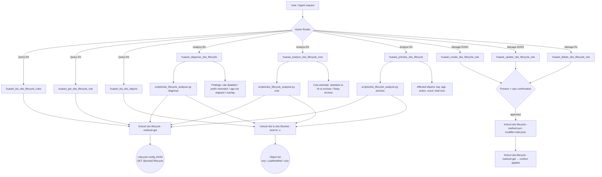
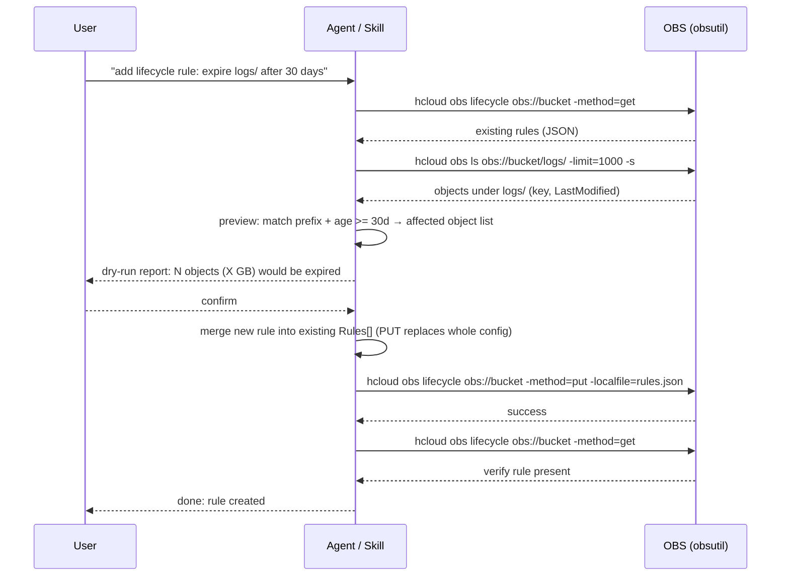

# Data Flow Diagram

```mermaid
flowchart TD
    U[User / Agent request] --> R{Action Router}

    R -->|Query R3| Q1[huawei_list_obs_lifecycle_rules]
    R -->|Query R3| Q2[huawei_get_obs_lifecycle_rule]
    R -->|Query R3| Q3[huawei_list_obs_objects]
    R -->|Analyze R3| A1[huawei_diagnose_obs_lifecycle]
    R -->|Analyze R3| A2[huawei_analyze_obs_lifecycle_cost]
    R -->|Analyze R3| A3[huawei_preview_obs_lifecycle]
    R -->|Manage R2/R1| M1[huawei_create_obs_lifecycle_rule]
    R -->|Manage R2/R1| M2[huawei_update_obs_lifecycle_rule]
    R -->|Manage R1| M3[huawei_delete_obs_lifecycle_rule]

    Q1 --> CLI1[ hcloud obs lifecycle -method=get ]
    Q2 --> CLI1
    Q3 --> CLI2[ hcloud obs ls obs://bucket -limit=N -s ]

    A1 --> AN[scripts/obs_lifecycle_analyzer.py diagnose]
    A2 --> AN2[scripts/obs_lifecycle_analyzer.py cost]
    A3 --> AN3[scripts/obs_lifecycle_analyzer.py preview]

    CLI1 --> RULES(("Lifecycle config JSON<br/>GET /{bucket}?lifecycle"))
    CLI2 --> OBJS(("Object list<br/>key / LastModified / size"))

    AN --> CLI1
    AN --> CLI2
    AN2 --> CLI1
    AN2 --> CLI2
    AN3 --> CLI1
    AN3 --> CLI2

    A1 --> OUT1[Findings: rule disabled / prefix mismatch / age not elapsed / overlap]
    A2 --> OUT2[Cost estimate: standard vs IA vs Archive / Deep Archive]
    A3 --> OUT3[Affected objects: key, age, action, count, total size]

    M1 --> GATE{Preview + user confirmation}
    M2 --> GATE
    M3 --> GATE
    GATE -->|approved| PUT[ hcloud obs lifecycle -method=put -localfile=rules.json ]
    PUT --> VERIFY[ hcloud obs lifecycle -method=get → confirm applied ]
```

## Sequence: manage a lifecycle rule (create/update/delete)

```mermaid
sequenceDiagram
    participant U as User
    participant A as Agent / Skill
    participant OB as OBS (obsutil)

    U->>A: "add lifecycle rule: expire logs/ after 30 days"
    A->>OB: hcloud obs lifecycle obs://bucket -method=get
    OB-->>A: existing rules (JSON)
    A->>OB: hcloud obs ls obs://bucket/logs/ -limit=1000 -s
    OB-->>A: objects under logs/ (key, LastModified)
    A->>A: preview: match prefix + age >= 30d → affected object list
    A-->>U: dry-run report: N objects (X GB) would be expired
    U-->>A: confirm
    A->>A: merge new rule into existing Rules[] (PUT replaces whole config)
    A->>OB: hcloud obs lifecycle obs://bucket -method=put -localfile=rules.json
    OB-->>A: success
    A->>OB: hcloud obs lifecycle obs://bucket -method=get
    OB-->>A: verify rule present
    A-->>U: done: rule created
```