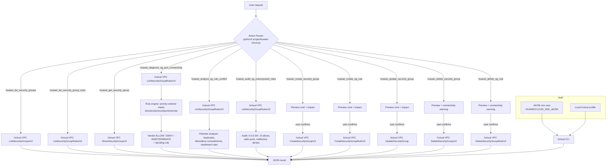

# Data Flow Diagram

```mermaid
flowchart TD
    U[User request] --> R{Action Router<br/>python3 scripts/huawei-cloud.py}

    R -->|huawei_list_security_groups| Q1[hcloud VPC ListSecurityGroups/v3]
    R -->|huawei_list_security_group_rules| Q2[hcloud VPC ListSecurityGroupRules/v3]
    R -->|huawei_get_security_group| Q3[hcloud VPC ShowSecurityGroup/v3]

    R -->|huawei_diagnose_sg_port_connectivity| D1[hcloud VPC ListSecurityGroupRules/v3]
    D1 --> D2[Rule engine: priority-ordered match<br/>direction/protocol/ports/remote]
    D2 --> D3[Verdict ALLOW / DENY / INDETERMINATE<br/>+ deciding rule]

    R -->|huawei_analyze_sg_rule_conflict| C1[hcloud VPC ListSecurityGroupRules/v3]
    C1 --> C2[Pairwise analysis: duplicates,<br/>allow/deny contradictions, shadowed rules]

    R -->|huawei_audit_sg_overexposed_rules| A1[hcloud VPC ListSecurityGroupRules/v3]
    A1 --> A2[Audit: 0.0.0.0/0 ::/0 allows,<br/>wide ports, ineffective denies]

    R -->|huawei_create_security_group| M1[Preview cmd + impact]
    M1 -->|user confirms| M2[hcloud VPC CreateSecurityGroup/v3]
    R -->|huawei_create_sg_rule| M3[Preview cmd + impact]
    M3 -->|user confirms| M4[hcloud VPC CreateSecurityGroupRule/v3]
    R -->|huawei_update_security_group| M5[Preview cmd + impact]
    M5 -->|user confirms| M6[hcloud VPC UpdateSecurityGroup]
    R -->|huawei_delete_security_group| M7[Preview + connectivity warning]
    M7 -->|user confirms| M8[hcloud VPC DeleteSecurityGroup/v3]
    R -->|huawei_delete_sg_rule| M9[Preview + connectivity warning]
    M9 -->|user confirms| M10[hcloud VPC DeleteSecurityGroupRule/v3]

    Q1 --> Out[JSON result]
    Q2 --> Out
    Q3 --> Out
    D3 --> Out
    C2 --> Out
    A2 --> Out
    M2 --> Out
    M4 --> Out
    M6 --> Out
    M8 --> Out
    M10 --> Out

    subgraph Auth
        ENV[AK/SK env vars<br/>HUAWEICLOUD_SDK_AK/SK]
        PROFILE[Local hcloud profile]
    end
    ENV --> H[hcloud CLI]
    PROFILE --> H
    H --> Out
```

All read paths (Query/Analyze) are R3 and execute automatically; all Manage paths (R2/R1)
stop at the preview stage until the user explicitly approves.