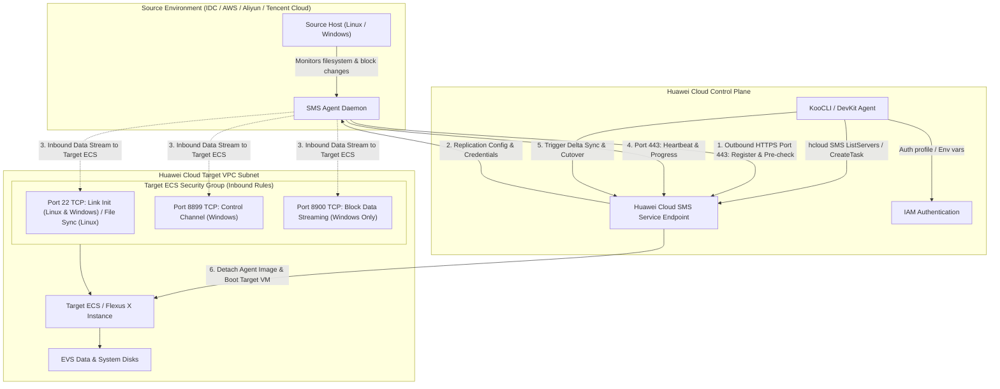

# Huawei Cloud SMS Host Migration Data Flow Diagram

This document illustrates the control plane and data plane architecture for host migration using Huawei Cloud SMS, specifically highlighting the security group and port requirements for both source and target sides.

## Migration Phase & Port Breakdown

1. **Discovery & Pre-check (Port 443 Outbound)**:
   - SMS Agent connects to the SMS control endpoint over HTTPS port 443 (China Site: `sms.cn-north-4.myhuaweicloud.com`; International Site Singapore: `sms.ap-southeast-3.myhuaweicloud.com`).
   - Posts diagnostic metrics: OS version, firmware, partition table, free disk space, and kernel compatibility.
2. **Replication Channel Setup & Bootstrap (Port 22 Inbound on Target ECS)**:
   - **Target Provisioning**: Target ECS is provisioned via template (`exist_server: false` for BIOS/Linux) or pre-created (`exist_server: true` for UEFI Windows).
   - Temporary migration kernel or bootstrap image is attached to the target ECS.
   - Communication channel initializes over TCP port 22 from the source server IP.
3. **Data Replication Channel (Inbound on Target ECS)**:
   - **Linux**: File-level replication (`MIGRATE_FILE`) via rsync over TCP port 22.
   - **Windows Server**: Block-level replication (`MIGRATE_BLOCK`) via TCP port 8899 (control channel) and TCP port 8900 (block streaming).
   - **Routing**: Routed via target EIP (public mode) or VPC intranet (private mode).
4. **Target Outbound Communication (Port 443 Outbound)**:
   - Target ECS communicates with cloud APIs and metadata services over outbound TCP port 443.
5. **Incremental Synchronization & Cutover**:
   - Repeated delta synchronization passes minimize final switchover downtime.
   - Upon final cutover, migration drivers are detached, target network settings are finalized, and the instance enters `ACTIVE` production state.
