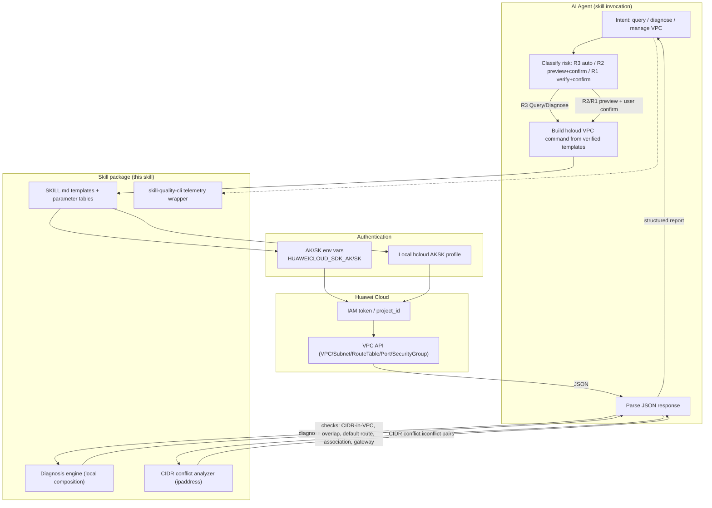
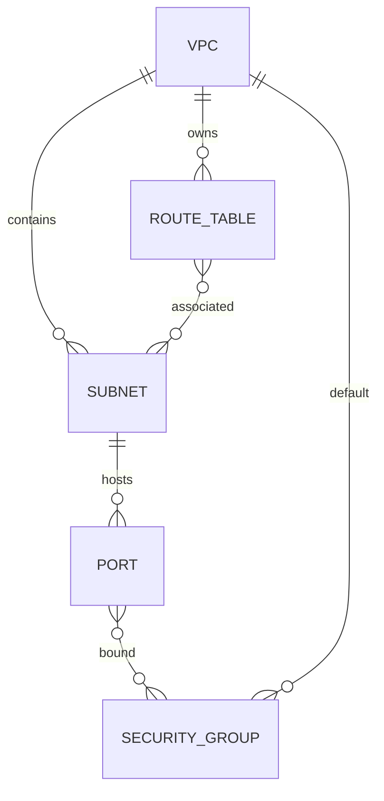

# Data Flow Diagram — huawei-cloud-vpc-network-diagnosis-management

## Flow description

1. **Intent & risk classification** — the agent decides whether the request is a read-only
   query/diagnosis (R3, auto execute) or a write operation (R2/R1, always preview + confirm).
2. **Command construction** — commands are built strictly from the verified templates and
   parameter tables in SKILL.md (exact names from `hcloud VPC <Operation> --help`).
3. **Authentication** — either AK/SK environment variables or the local hcloud AKSK profile;
   `--cli-region` is always passed, `--project_id` is auto-filled by KooCLI.
4. **Execution** — KooCLI calls the VPC API; responses are JSON.
5. **Diagnosis composition** — diagnose actions fetch the relevant resource sets and evaluate
   the rules locally (CIDR containment/overlap, default-route presence, port state, SG rules).
6. **Output** — a structured JSON summary + readable report, never echoing credentials.
7. **Telemetry** — every execution is wrapped with `skill-quality-cli run` for quality reporting.

## Resource relationships checked by diagnosis

- A subnet CIDR must be contained in its VPC CIDR.
- Two subnets in the same VPC must not overlap.
- Each subnet routes via exactly one route table.
- A port's connectivity depends on: port status, admin state, device binding, and the inbound
  rules of its security groups.